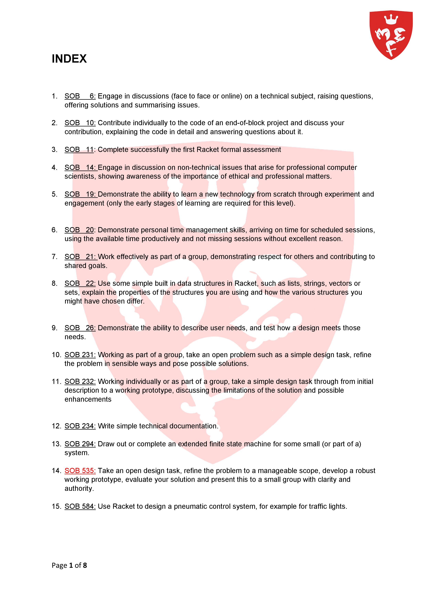
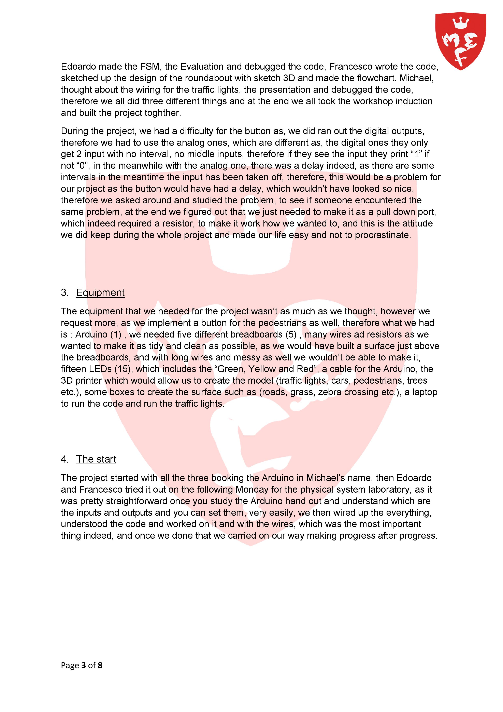
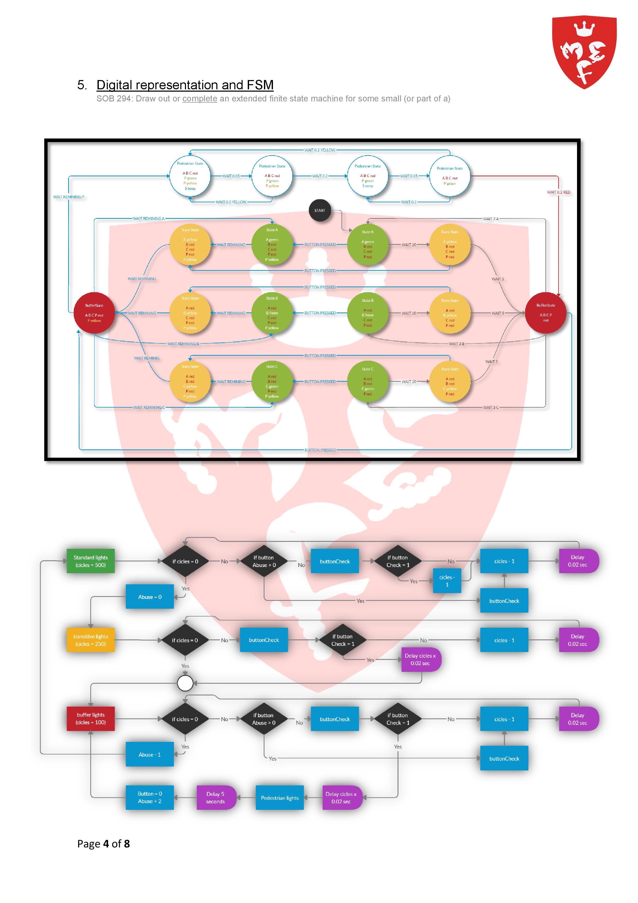
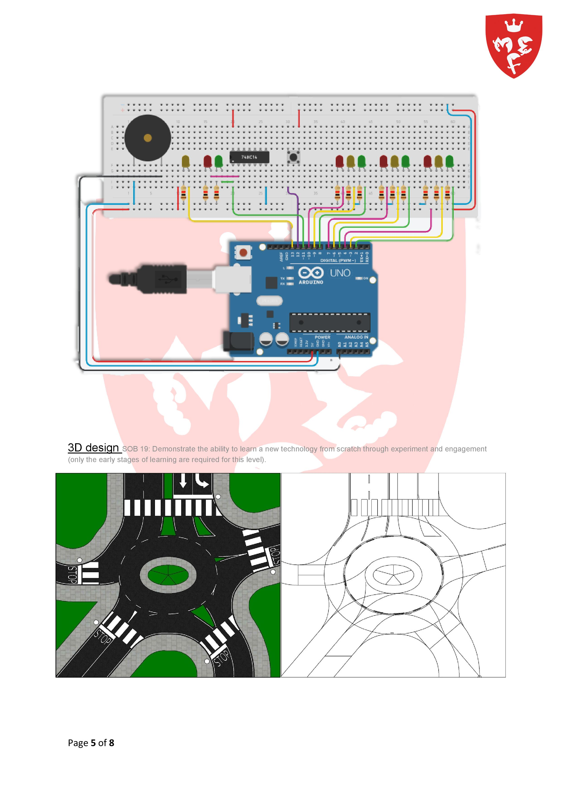
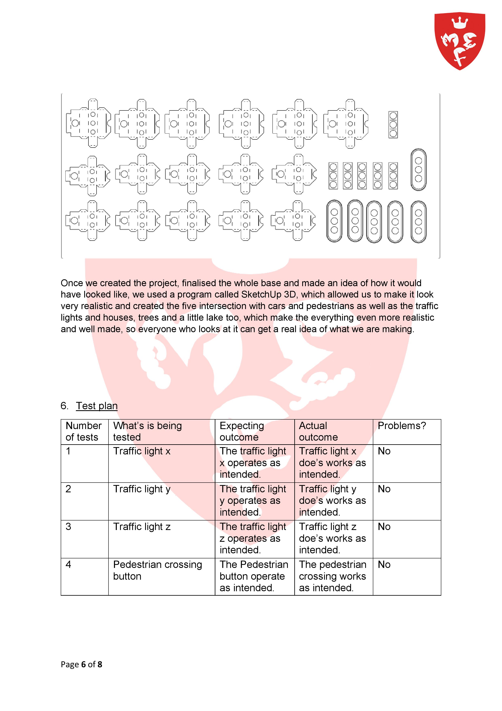
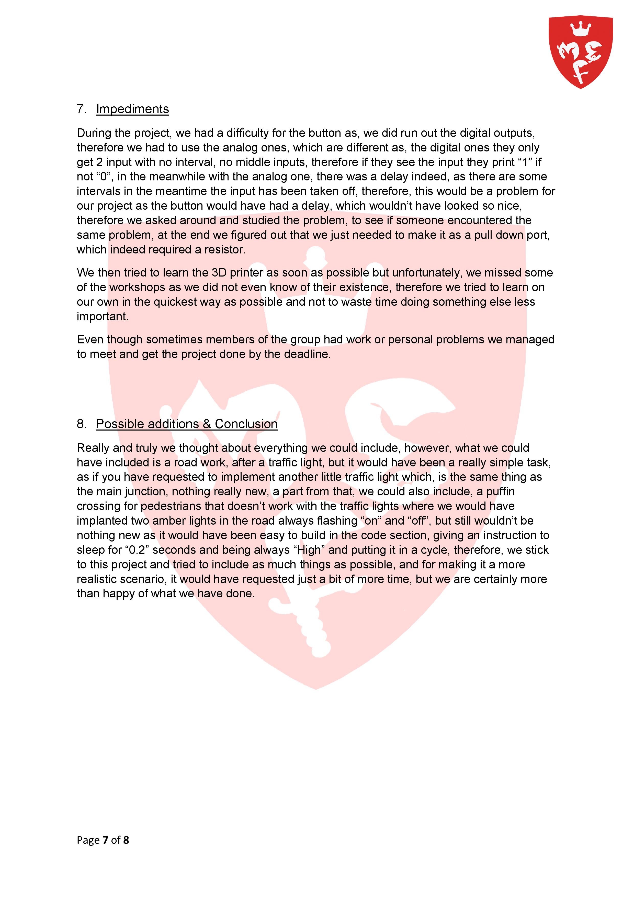
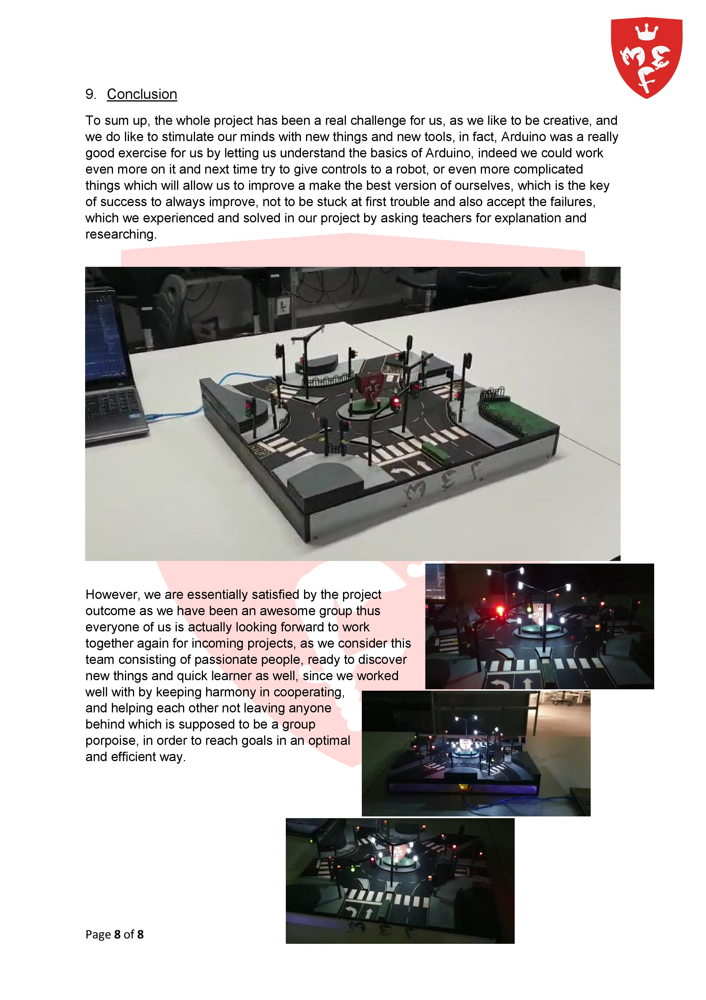

# TrafficLights

Welcome to the **TrafficLights** project! This is the first project developed during the Computer Science first-year course, focusing on Programming and Design using Racket. In this project, we aim to create a Trafficlights simulation by integrating Racket with Arduino.

## Overview

The Trafficlights simulation involves using Racket to control an Arduino board, creating an interactive simulation of traffic signal lights. This project showcases how Racket can interact with hardware components like Arduino to provide real-world applications.

## Getting Started

To run this project and experience the Trafficlights simulation, follow these steps:

1. Clone this repository to your local machine.
2. Navigate to the `TrafficLights` directory.
3. Set up the necessary hardware components, including the Arduino board.
4. Run the Racket code to control the Trafficlights simulation.

## Prerequisites

To run this project, you need the following:

- Racket - Installed on your system to execute the Racket code.
- Arduino Board - For hardware interaction and simulation.

## Contributions

Contributions to this project are welcome. If you have any suggestions for improvements or want to add more features to the Trafficlights simulation, feel free to submit a pull request.

## License

This project is under the [MIT License](https://en.wikipedia.org/wiki/MIT_License), allowing you to use, modify, and distribute the code freely.

Let's create an engaging Trafficlights simulation using Racket and Arduino! 🚦🚗💡

**INDEX**

1. SOB     6: Engage in discussions (face to face or online) on a technical subject, raising questions, offering solutions and summarising issues.

2. SOB   10: Contribute individually to the code of an end-of-block project and discuss your contribution, explaining the code in detail and answering questions about it.

3. SOB   11: Complete successfully the first Racket formal assessment

4. SOB   14: Engage in discussion on non-technical issues that arise for professional computer scientists, showing awareness of the importance of ethical and professional matters.

5. SOB   19: Demonstrate the ability to learn a new technology from scratch through experiment and engagement (only the early stages of learning are required for this level).

6. SOB   20: Demonstrate personal time management skills, arriving on time for scheduled sessions, using the available time productively and not missing sessions without excellent reason.

7. SOB   21: Work effectively as part of a group, demonstrating respect for others and contributing to shared goals.

8. SOB   22: Use some simple built in data structures in Racket, such as lists, strings, vectors or sets, explain the properties of the structures you are using and how the various structures you might have chosen differ.

9. SOB   26: Demonstrate the ability to describe user needs, and test how a design meets those needs.

10. SOB 231: Working as part of a group, take an open problem such as a simple design task, refine the problem in sensible ways and pose possible solutions.

11. SOB 232: Working individually or as part of a group, take a simple design task through from initial description to a working prototype, discussing the limitations of the solution and possible enhancements

12. SOB 234: Write simple technical documentation.

13. SOB 294: Draw out or complete an extended finite state machine for some small (or part of a) system.

14. SOB 535: Take an open design task, refine the problem to a manageable scope, develop a robust working prototype, evaluate your solution and present this to a small group with clarity and authority.

15. SOB 584: Use Racket to design a pneumatic control system, for example for traffic lights.

**Traffic Light Project**

1. Overview

Here as shown in the picture below, we do have a classic roundabout, with five intersection, which two of them work together, as we found easier to name them, instead of calling them (intersection 1, 2, 3 etc.), we worked out which intersection should have worked together to make the roundabout work more efficiently, therefore making some research of how roundabouts with traffic lights work, we have seen that they work in diagonal, which seems to be the best way, indeed we named them with three letters (A, B and C) where "A" and “B” have “A1” and “B1” and “C” works by itself, this way the roundabout work in a way that cars are able to get into it and not to build up traffic, in fact as we can see we did include a pedestrian cross for those people who would like to cross the road, and they will be asked to press a button indeed to let acknowledge to the traffic lights that there are pedestrians waiting to cross the road.

2. Delegation

We have a group of three people, which are able to work independently and also in group very well, and in a very efficient way, indeed we worked in everything together, we wanted to do something different than a simple junction and in fact we came up with the idea of a roundabout, then all together worked out a way to make it work, studied the code and the assigned to each other different thing, just to make it quick and easy. 

Edoardo made the FSM, the Evaluation and debugged the code, Francesco wrote the code, sketched up the design of the roundabout with sketch 3D and made the flowchart. Michael, thought about the wiring for the traffic lights, the presentation and debugged the code, therefore we all did three different things and at the end we all took the workshop induction and built the project toghther.

During the project, we had a difficulty for the button as, we did ran out the digital outputs, therefore we had to use the analog ones, which are different as, the digital ones they only get 2 input with no interval, no middle inputs, therefore if they see the input they print "1" if not “0”, in the meanwhile with the analog one, there was a delay indeed, as there are some intervals in the meantime the input has been taken off, therefore, this would be a problem for our project as the button would have had a delay, which wouldn’t have looked so nice, therefore we asked around and studied the problem, to see if someone encountered the same problem, at the end we figured out that we just needed to make it as a pull down port, which indeed required a resistor, to make it work how we wanted to, and this is the attitude we did keep during the whole project and made our life easy and not to procrastinate.

3. Equipment 

The equipment that we needed for the project wasn’t as much as we thought, however we request more, as we implement a button for the pedestrians as well, therefore what we had is : Arduino (1) , we needed five different breadboards (5) , many wires ad resistors as we wanted to make it as tidy and clean as possible, as we would have built a surface just above the breadboards, and with long wires and messy as well we wouldn’t be able to make it, fifteen LEDs (15), which includes the "Green, Yellow and Red", a cable for the Arduino, the 3D printer which would allow us to create the model (traffic lights, cars, pedestrians, trees etc.), some boxes to create the surface such as (roads, grass, zebra crossing etc.), a laptop to run the code and run the traffic lights. 

4. The start

The project started with all the three booking the Arduino in Michael’s name, then Edoardo and Francesco tried it out on the following Monday for the physical system laboratory, as it was pretty straightforward once you study the Arduino hand out and understand which are the inputs and outputs and you can set them, very easily, we then wired up the everything, understood the code and worked on it and with the wires, which was the most important thing indeed, and once we done that we carried on our way making progress after progress. 

5. Digital representation and FSM

SOB 294: Draw out or complete an extended finite state machine for some small (or part of a)

3D design SOB 19: Demonstrate the ability to learn a new technology from scratch through experiment and engagement (only the early stages of learning are required for this level).

Once we created the project, finalised the whole base and made an idea of how it would have looked like, we used a program called SketchUp 3D, which allowed us to make it look very realistic and created the five intersection with cars and pedestrians as well as the traffic lights and houses, trees and a little lake too, which make the everything even more realistic and well made, so everyone who looks at it can get a real idea of what we are making.  

6. Test plan

<table>
  <tr>
    <td>Number of tests</td>
    <td>What’s is being tested</td>
    <td>Expecting outcome</td>
    <td>Actual outcome</td>
    <td>Problems?</td>
  </tr>
  <tr>
    <td>1</td>
    <td>Traffic light x</td>
    <td>The traffic light x operates as intended. </td>
    <td>Traffic light x doe’s works as intended.</td>
    <td>No</td>
  </tr>
  <tr>
    <td>2</td>
    <td>Traffic light y</td>
    <td>The traffic light y operates as intended.</td>
    <td>Traffic light y doe’s works as intended.</td>
    <td>No</td>
  </tr>
  <tr>
    <td>3</td>
    <td>Traffic light z</td>
    <td>The traffic light z operates as intended.</td>
    <td>Traffic light z doe’s works as intended.</td>
    <td>No</td>
  </tr>
  <tr>
    <td>4</td>
    <td>Pedestrian crossing button </td>
    <td>The Pedestrian button operate as intended.</td>
    <td>The pedestrian crossing works as intended. </td>
    <td>No</td>
  </tr>
</table>

7. Impediments

During the project, we had a difficulty for the button as, we did run out the digital outputs, therefore we had to use the analog ones, which are different as, the digital ones they only get 2 input with no interval, no middle inputs, therefore if they see the input they print "1" if not “0”, in the meanwhile with the analog one, there was a delay indeed, as there are some intervals in the meantime the input has been taken off, therefore, this would be a problem for our project as the button would have had a delay, which wouldn’t have looked so nice, therefore we asked around and studied the problem, to see if someone encountered the same problem, at the end we figured out that we just needed to make it as a pull down port, which indeed required a resistor.

We then tried to learn the 3D printer as soon as possible but unfortunately, we missed some of the workshops as we did not even know of their existence, therefore we tried to learn on our own in the quickest way as possible and not to waste time doing something else less important. 

Even though sometimes members of the group had work or personal problems we managed to meet and get the project done by the deadline. 

8. Possible additions & Conclusion

Really and truly we thought about everything we could include, however, what we could have included is a road work, after a traffic light, but it would have been a really simple task, as if you have requested to implement another little traffic light which, is the same thing as the main junction, nothing really new, a part from that, we could also include, a puffin crossing for pedestrians that doesn’t work with the traffic lights where we would have implanted two amber lights in the road always flashing "on" and “off”, but still wouldn’t be nothing new as it would have been easy to build in the code section, giving an instruction to sleep for “0.2” seconds and being always “High” and putting it in a cycle, therefore, we stick to this project and tried to include as much things as possible, and for making it a more realistic scenario, it would have requested just a bit of more time, but we are certainly more than happy of what we have done. 

9. Conclusion 

To sum up, the whole project has been a real challenge for us, as we like to be creative, and we do like to stimulate our minds with new things and new tools, in fact, Arduino was a really good exercise for us by letting us understand the basics of Arduino, indeed we could work even more on it and next time try to give controls to a robot, or even more complicated things which will allow us to improve a make the best version of ourselves, which is the key of success to always improve, not to be stuck at first trouble and also accept the failures, which we experienced and solved in our project by asking teachers for explanation and researching.

However, we are essentially satisfied by the project outcome as we have been an awesome group thus everyone of us is actually looking forward to work together again for incoming projects, as we consider this team consisting of passionate people, ready to discover new things and quick learner as well, since we worked well with by keeping harmony in cooperating, and helping each other not leaving anyone behind which is supposed to be a group porpoise, in order to reach goals in an optimal and efficient way. 

